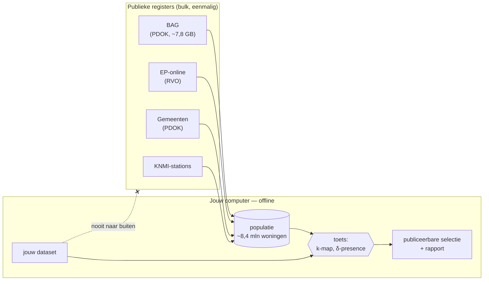

# anonymate — herleidbaarheidstoets voor woningdata

Een lokale tool die toetst of woning- en energiedata **te herleiden** zijn tot een adres, voordat
je ze publiceert. Hij vergelijkt elk record met de volledige Nederlandse woningvoorraad (BAG,
EP-online) en laat zien welke records je veilig kunt delen, eventueel na het grover maken van
kenmerken.

De vraag is telkens dezelfde: **op hoeveel woningen in Nederland lijkt dit record, en weet een
aanvaller daarmee welke woning het is?**

**Nieuw hier?** Begin bij [Snel beginnen](#snel-beginnen): in vijf minuten een eerste toets, ook
zonder downloads. *[English summary below](#english).*

## Inhoudsopgave

* [Hoe het werkt](#hoe-het-werkt)
* [Wat doet het](#wat-doet-het)
  * [Herleidbaarheid meten: k-map en δ-presence](#herleidbaarheid-meten-k-map-en-δ-presence)
  * [Verdachte kolommen vinden](#verdachte-kolommen-vinden)
  * [Weer als verborgen locatie](#weer-als-verborgen-locatie)
  * [Aanvallersscenario's en populatie-afbakening](#aanvallersscenarios-en-populatie-afbakening)
  * [Anonimiseren: grover maken en weglaten](#anonimiseren-grover-maken-en-weglaten)
* [Gebruiken](#gebruiken)
  * [Snel beginnen](#snel-beginnen)
  * [Eénmalig: de populatie opbouwen](#eénmalig-de-populatie-opbouwen)
  * [Sneller: een datapakket plus je eigen EP-online-bestand](#sneller-een-datapakket-plus-je-eigen-ep-online-bestand)
  * [Toetsen](#toetsen)
  * [Uitvoer](#uitvoer)
* [Hoe het rekent](#hoe-het-rekent)
* [Ontwikkelen](#ontwikkelen)
* [Documentatie](#documentatie)
* [Status](#status)
* [Codeondertekening](#codeondertekening)
* [Licentie](#licentie)
* [Met dank aan](#met-dank-aan)
* [English](#english)

## Hoe het werkt



Het principe is **alles lokaal, tegen de hele populatie**:

1. **Eén keer downloaden, in bulk.** De publieke registers worden in hun geheel opgehaald, niet
   per adres bevraagd. Zo lekt de tool nooit welke adressen je toetst, en rekent hij tegen de
   échte achtergrondpopulatie in plaats van een fragment ervan.
2. **Daarna volledig offline.** Toetsen, grover maken en rapporteren gebeuren op je eigen
   computer. Er is geen webserver en geen netwerkpoort.
3. **Reproduceerbaar.** Elk rapport vermeldt de exacte versie van elke bron.

## Wat doet het

### Herleidbaarheid meten: k-map en δ-presence

Per record telt anonymate hoeveel woningen in de (afgebakende) populatie passen bij alles wat het
record prijsgeeft: **k**. De kans op een juiste heridentificatie is 1/k. Daarnaast berekent het
welk deel **δ** van die woningen in de dataset zit: de kans dat een aanvaller terecht concludeert
*dát* een woning meedoet. Een record is publiceerbaar als k ≥ round(1/p) en δ ≤ p, met p vrij
instelbaar tussen 0,05 en 0,33. De standaard is p = 0,09 (k ≥ 11), de waarde die in de medische
wereld gangbaar is; netbeheerders hanteren k ≥ 10 voor verbruiksdata per postcode.

Kenmerken mogen exact zijn (`1974`) of al in klassen (`1960-1979`, `[150 - 199]`, `<1945`,
`2000=>`, `A|B`); een klasse telt als het hele bereik.

### Verdachte kolommen vinden

anonymate stelt per kolom voor wat die is, op basis van de naam (Nederlands en Engels) en de
waarden:

| rol | voorbeelden | wat ermee gebeurt |
|---|---|---|
| **directe identificator** | adres, huisnummer, coördinaten, BAG-ID, absolute meterstanden | nooit publiceren |
| **quasi-identifier** | bouwjaar, oppervlakte, energielabel, woningtype, postcode, gemeente | meetellen in de toets |
| **verborgen locatie** | weerstation, H3-cel, lat/lon van een weer-interpolatiepunt | omzetten naar een regio en meetellen |
| **afgeleid** | specificaties die volledig uit een toesteltype volgen | lekt hetzelfde als de bron |
| **meetwaarde** | tijdreeksen, temperaturen | geen quasi-identifier |

Elk voorstel kun je overrulen.

### Weer als verborgen locatie

Weer bij de woning is nuttig, maar wijst de locatie aan. In de stap **Weerlocatie** kies je hoe
grof: het dichtstbijzijnde KNMI-station, of een H3-cel na willekeurige ruis (standaard niveau 5,
σ = 10 km). Een kaart laat per cel zien hoeveel woningen erin staan en, na een klik, waar een woning
met die cel werkelijk kan liggen. Staat er al weer in de dataset, dan speelt anonymate rechercheur:
`anonymate weerspoor` (of "Weer al in de data?" in het venster) zoekt welk station, welke cel of
welk punt de reeksen verklaart, ook bij verschoven uren, zomertijd, stationswissels en afwijkende
stationssets, en toetst die locatie mee. Zie
[`docs/herleidbaarheid-uitleg.md`](docs/herleidbaarheid-uitleg.md), paragraaf 5.

### Aanvallersscenario's en populatie-afbakening

Wat een aanvaller weet, bepaalt wat meetelt:

* **register**: alleen wat in openbare registers staat (BAG, EP-online);
* **zichtbaar**: ook wat je van buitenaf ziet (zonnepanelen, glas, buitenunit);
* **insider**: ook wat een installateur, leverancier of buur weet (installatiedatum, vermogen,
  jaarverbruik).

Kenmerken zonder volledig register worden **geschat** uit de verdeling in de dataset; het rapport
markeert dat. Publiek bekende **inclusiecriteria** ("vrijstaande en twee-onder-een-kapwoningen van vóór
1990 in Gelderland") horen in de populatie-afbakening: ze zijn achtergrondkennis, en wie ze weglaat
onderschat het risico.

### Anonimiseren: grover maken en weglaten

Klassen (`bouwjaar` per 10 jaar, met open staarten), eigen klassegrenzen, categorieën samenvoegen
(labels A-B / C-D / E-G), locatie vergroven (postcode → gemeente → provincie), begrensde ruis
toevoegen en kenmerken weglaten. Ruis telt eerlijk mee: de toets gaat uit van een aanvaller die de
methode kent en een waarde met ruis tot ±n dus als bereik leest. Is een dataset al met ruis
gepubliceerd (bijvoorbeeld een locatie met ruis vóór het snappen naar een H3-cel), dan geef je die
tolerantie op en telt de toets de buurcellen mee.

Na elke stap toont anonymate hoeveel records slagen en hoeveel detail het kost; `suggest` zoekt
zelf een reeks stappen. Weglaten is niet gratis: het rapport meet per kolom hoeveel het
gepubliceerde deel verschuift ten opzichte van de hele dataset, en of dat meer is dan bij
willekeurig weglaten.

## Gebruiken

Drie manieren, voor drie soorten gebruikers:

| | voor wie | hoe |
|---|---|---|
| **desktopvenster** | wie liever niet in een terminal werkt | `anonymate-gui`, of het [Windows-programma](https://github.com/anonymate-nl/anonymate/releases) zonder Python-installatie (zie ook [anonymate.nl](https://anonymate.nl)) |
| **stap voor stap** | wie de terminal wel gebruikt maar de opties niet wil leren | `anonymate wizard` |
| **opdrachtregel en library** | analisten, ICT'ers, batchverwerking | `anonymate assess …`, `import anonymate` |

### Snel beginnen

Vereist Python 3.11 of nieuwer.

```bash
pipx install "anonymate[gui] @ git+https://github.com/anonymate-nl/anonymate"
```

In het venster begin je het snelst met **Oefenen met het voorbeeld** (stap 1): 62 verzonnen
woningen, hun weer ([`docs/voorbeeld/weer.csv`](docs/voorbeeld/weer.csv)) en een verzonnen
Nederland om ze in te zoeken, zonder downloads. Een oranje balk laat zien dat je oefent; je
eigen dataset openen stopt de oefenmodus.

Op de opdrachtregel probeer je het voorbeeldbestand [`docs/voorbeeld/woningen.csv`](docs/voorbeeld/woningen.csv)
(62 verzonnen woningen, waarvan één aan de dunbevolkte Noord-Hollandse kust en één op Vlieland; download het, of clone de repo):

```bash
anonymate detect woningen.csv
anonymate assess woningen.csv --auto --qid postcode=direct --synthetic
anonymate suggest woningen.csv --auto --qid postcode=direct --synthetic
```

1. `detect` wijst de verdachte kolommen aan: huisnummer is een directe identificator, bouwjaar,
   oppervlakte en woningtype zijn quasi-identifiers, jaarverbruik kent alleen een insider.
2. `assess` toetst: met exact bouwjaar, exacte oppervlakte, gemeente, type en label is **geen
   enkele** woning publiceerbaar, want elke woning is uniek. `--qid postcode=direct` zegt dat de
   postcode niet gepubliceerd wordt.
3. `suggest` zoekt wat je grover moet maken: bouwjaar in klassen van 10 jaar, oppervlakte per
   25 m² en provincie in plaats van gemeente maken de meeste woningen publiceerbaar.

`--synthetic` gebruikt een verzonnen populatie: handig om de tool te leren kennen, niet om
conclusies aan te verbinden. Voor een echte toets bouw je eerst de populatie op (hieronder), en laat
je `--synthetic` weg. Met een eigen dataset: `anonymate detect mijn-dataset.csv` en verder zoals
hierboven.

### Eénmalig: de populatie opbouwen

```bash
anonymate ingest all        # BAG, gemeenten, KNMI-stations, EP-online
anonymate build             # -> één compact bestand met alle woningen
anonymate status            # welke bronnen, welke versies
```

* **Grote originelen elders bewaren** (externe schijf, NAS): `--downloads <map>` of
  `ANONYMATE_DOWNLOADS=<map>` (ook in een `.env`-bestand). Alleen het compacte eindbestand
  (~0,5 GB) staat in `%LOCALAPPDATA%\anonymate` (of `ANONYMATE_HOME`) en wordt bij de toets
  gelezen.
* **EP-online** vraagt een gratis API-sleutel, aan te vragen via
  [ep-online.nl](https://www.ep-online.nl). Zet die als `EPONLINE_API_KEY` in de omgeving of in
  `.env`. Zonder sleutel werkt alles, maar zonder energielabels.
* Past op een laptop met 8 GB geheugen: inlezen en opbouwen gebeuren in blokken, met een vaste
  geheugengrens.

### Sneller: een datapakket plus je eigen EP-online-bestand

De hele woningvoorraad zelf opbouwen kost enkele uren (vooral de BAG). Het kan ook in een paar
minuten, met het **datapakket** dat maandelijks automatisch wordt gebouwd uit BAG, 3D-BAG en KNMI.
Daar zit niets uit EP-online in: de energielabels en de signaturen die ze gebruiken, koppel je
zelf, lokaal, met je eigen EP-online-bestand.

1. **Datapakket ophalen.** Voorlopig staat het bij de maandelijkse run van de workflow
   [populatie](https://github.com/anonymate-nl/anonymate/actions/workflows/populatie.yml): kies de
   laatste geslaagde run en download onderaan het artefact `datapakketten` (zip, ~420 MB; daarvoor
   heb je een GitHub-account nodig). Een gewone download zonder account volgt.
2. **EP-online-sleutel aanvragen** (gratis) via [ep-online.nl](https://www.ep-online.nl) en als
   `EPONLINE_API_KEY` in de omgeving of in `.env` zetten. Dan:
   ```bash
   anonymate ingest ep-online                 # downloadt het totaalbestand met jouw sleutel
   ```
   Heb je het totaalbestand al (zip of csv), dan zonder sleutel:
   `anonymate ingest ep-online --file <totaalbestand>`.
3. **Populatie maken uit het pakket**, met je labels erbij gekoppeld:
   ```bash
   anonymate ingest pakket --file <map of zip van het datapakket>
   anonymate status                           # bronnen en versies, ook "(uit datapakket)"
   ```

Zonder stap 2 werkt het ook, maar zonder energielabels: de toets onderschat dan het risico als je
dataset een label of een signatuur uit het label bevat. In het Windows-programma gaat het met
dezelfde opdrachten via `anonymate.exe` in de uitgepakte map. De browserversie en het venster van
het Windows-programma krijgen hier een sleepvlak voor (kladbloknotitie 14).

### Toetsen

```bash
anonymate assess mijn-dataset.csv --auto --out uitvoer   # toetsen met gedetecteerde kenmerken
anonymate suggest mijn-dataset.csv --auto                # welke generalisaties helpen?
anonymate wizard mijn-dataset.csv                        # stap voor stap met vragen
anonymate weerspoor weer.csv --dataset mijn-dataset.csv # waar komt het weer vandaan?
anonymate-gui                                            # desktopvenster
```

| optie | betekenis |
|---|---|
| `--qid kolom=bouwjaar` | kolom als quasi-identifier (ook `direct` of `geen`) |
| `--p 0.09` | maximale kans op heridentificatie, 0,05-0,33 |
| `--scenario register\|zichtbaar\|insider` | wat de aanvaller weet |
| `--scope gemeente=Zwolle,Deventer` | populatie afbakenen (ook `bouwjaar=1900-1989`, `woningtype=vrijstaand,twee_onder_een_kap`) |
| `--koppel postcode,huisnummer` | registerwaarden lokaal ophalen bij adressen of BAG-ID's |
| `--config analyse.toml` | alles vastleggen in een bestand, zie het [voorbeeld](docs/config-voorbeeld.toml) |

Invoer: CSV, Excel of Parquet.

### Uitvoer

| bestand | inhoud |
|---|---|
| `publiceerbaar.csv` | records die de toets doorstaan, zonder directe identificatoren |
| `rapport.md` | samenvatting, drempel, bronversies, generalisatiestappen, representativiteit (wat het weglaten verschuift), bits per kenmerk, insiders per databron |
| `samenvatting.json` | idem, machineleesbaar |
| `rapport_per_record.csv` | per record k, δ, status en reden: **intern, niet publiceren** |

## Hoe het rekent

**Eerst de norm, dan toetsen, dan afwegen.** Stel de privacynorm p vast vóór je naar uitkomsten
kijkt, en pas hem daarna niet aan op de uitkomst. Binnen die norm weeg je af: kenmerken grover
maken of afronden (privacy tegen bruikbaarheid), en woningen die te herleidbaar blijven niet
publiceren. Het desktopvenster dwingt die volgorde af; `signatuur publiceer` weigert zonder `--p`.

* **Een gepubliceerde waarde is een voorwaarde op de populatie.** `bouwjaar 1960-1979` betekent
  "elke woning met een bouwjaar in dat bereik"; een lege cel betekent "elke woning".
* **Onbekende registerwaarden** (bijvoorbeeld een woning zonder geregistreerd label) tellen
  standaard *niet* mee als overeenkomst. Dat maakt klassen kleiner en de toets dus strenger.
* **Geschatte k.** Voor kenmerken zonder register wordt het aantal woningen geschat als k uit de
  registers × de frequentie van de waarde in de dataset, per kenmerk vermenigvuldigd.
* **Waarom geen ARX of τ-ARGUS?** Beide zijn Java, lastig mee te leveren, en rekenen standaard
  *binnen* de dataset. De populatietelling die hier nodig is, is met DuckDB-joins over de lokale
  registers compact, snel (seconden voor 8 miljoen woningen) en volledig te testen.

## Ontwikkelen

```bash
git clone https://github.com/anonymate-nl/anonymate
cd anonymate
python -m venv .venv && .venv/Scripts/pip install -e ".[dev,gui]"   # Linux/macOS: .venv/bin/pip
pytest -q
```

De code staat in [`src/anonymate/`](src/anonymate), één module per verantwoordelijkheid:

| module | wat |
|---|---|
| `constraints` | gepubliceerde waarden als voorwaarde (exact, bereik, verzameling) |
| `qids` | catalogus van quasi-identifiers en wie ze kan kennen |
| `population` | de populatie in DuckDB, met afbakening |
| `risk` | k-map en δ-presence |
| `generalize` | anonimiseringsacties (ook ruis), informatieverlies, zoekfunctie |
| `explain` | uitleg: bits per kenmerk, insiders per databron |
| `signature` | warmtesignatuur uit alleen een adres en openbare gegevens (nta8800, mwa, best) |
| `rounding` | afrondingsanalyse en rainbow-frequentietabellen |
| `publicatie` | een afgeronde adres-signatuur per woning toevoegen, toetsen en afwegen |
| `detect` | voorstellen per kolom |
| `weerspoor` | weerreeksen terugleiden naar station, H3-cel of punt (de rechercheur) |
| `representativiteit` | wat het weglaten van records met de gepubliceerde kolommen doet |
| `synthetic`, `voorbeeld` | het verzonnen Nederland en de voorbeelddata van de oefenmodus |
| `store` | bulk-ingest en opbouw van de populatie — **de enige module met netwerkverkeer** |
| `link` | lokaal koppelen via adres of BAG-ID |
| `report`, `cli`, `wizard`, `gui` | uitvoer en de drie manieren van gebruik (`gui_kaart`, `gui_tekening`: kaart en grafieken) |

Tests draaien op synthetische data; een test bewaakt dat de toets zelf geen netwerk gebruikt.
Bijdragen zijn welkom via een issue of pull request.

## Documentatie

* [`docs/herleidbaarheid-uitleg.md`](docs/herleidbaarheid-uitleg.md) — begin hier: wat
  herleidbaarheid is, hoe anonymate het meet, en wat er bijzonder is aan woningregisters en
  energiedata.
* [`docs/config-voorbeeld.toml`](docs/config-voorbeeld.toml) — alle instellingen van een toets,
  met uitleg.
* [`docs/herleidbaarheid-uitleg.md`](docs/herleidbaarheid-uitleg.md) — herleidbaarheid van
  woning- en energiedata uitgelegd: meten, aanvallers, verborgen locatie (weer, H3-cellen met
  ruis), afwegen en transparantie, met kaarten.
* [`docs/warmtesignatuur.md`](docs/warmtesignatuur.md) — de signatuur uit
  openbare gegevens, de rainbow table en hoe grof je moet publiceren.
* [`docs/voorbeeld/`](docs/voorbeeld) — de voorbeelddata van de oefenmodus (verzonnen woningen en
  hun weer) en het script dat ze maakt.
* [`docs/werk/KLADBLOK.md`](docs/werk/KLADBLOK.md) — wat nog moet gebeuren.
* De docstrings bovenaan elke module in [`src/anonymate/`](src/anonymate) — de redenering achter
  elke keuze.

## Status

Project is: _in ontwikkeling_. De kern (toetsen, detecteren, grover maken, ruis, rapporteren met
uitleg in bits en insiders per databron) werkt en is getest; de populatie wordt opgebouwd uit de
actuele BAG en EP-online, en is beproefd op een openbare dataset van ~175 woningen. Nog niet
inhoudelijk gereviewd door derden. Wat nog moet gebeuren staat in het
[kladblok](docs/werk/KLADBLOK.md).

**Herleidbaarheidstoets op aanvraag.** Wil je een dataset laten toetsen die je niet zelf wilt of
kunt analyseren? Neem contact op via een issue in deze repository.

## Verifieerbaar

De browserversie op <https://anonymate.nl/app/> is gebouwd uit deze repository, en dat is na te
gaan: de build is reproduceerbaar, `manifest.json` bevat de commit en de SHA-256 van elk bestand,
en GitHub Actions legt de herkomst vast als attestatie. Rekenen kan met
`python web/controleer.py` (bouwt dezelfde commit opnieuw en vergelijkt met de live site) en
`gh attestation verify manifest.json --repo anonymate-nl/anonymate`. Stap voor stap, ook voor wie
alleen het netwerkverkeer in de browser wil bekijken, staat het op
[anonymate.nl/controleer.html](https://anonymate.nl/controleer.html)
([bron](website/controleer.html)).

## Codeondertekening

Het Windows-programma is nog niet ondertekend; Windows waarschuwt daarom bij de eerste start.
Ondertekening via de [SignPath Foundation](https://signpath.org) (gratis codeondertekening door
[SignPath.io](https://about.signpath.io) voor open source) is aangevraagd; daarvoor moet het project
eerst breder bekend zijn. Zodra het zover is, geldt dit beleid:

Alleen wat GitHub Actions bouwt uit de broncode in deze repository
([`release.yml`](.github/workflows/release.yml)) wordt ondertekend, en elke release pas nadat
een goedkeurder dat op SignPath heeft toegestaan.

* Committers en reviewers: [Henri ter Hofte](https://github.com/henriterhofte)
* Goedkeurders (approvers): [Henri ter Hofte](https://github.com/henriterhofte)

**Privacy.** Dit programma stuurt geen informatie naar andere systemen in een netwerk, tenzij
de gebruiker daar zelf om vraagt: alleen `anonymate ingest` downloadt, op verzoek, de openbare
registers (BAG, EP-online, KNMI). *This program will not transfer any information to other
networked systems unless specifically requested by the user or the person installing or
operating it.*

## Licentie

Deze software is beschikbaar onder de [European Union Public Licence v1.2 (EUPL-1.2)](LICENSE),
© 2026 Henri ter Hofte.

## Met dank aan

Deze software is geschreven door:

* Henri ter Hofte · [@henriterhofte](https://github.com/henriterhofte)

Ontwikkeld met [Claude Code](https://claude.com/claude-code) (Anthropic) als AI-programmeerassistent;
commits waaraan Claude Code heeft bijgedragen hebben een `Co-Authored-By`-regel.

De opzet bouwt voort op ideeën uit *NeedForHeat AnonyMate* (Lectoraat Energietransitie, Hogeschool
Windesheim; KITE Expert Meeting, 10 april 2025), en op de drempelwaarden en de afweging tussen
risico en bruikbaarheid uit El Emam & Arbuckle (2013), *Anonymizing Health Data*, O'Reilly.

We gebruiken databronnen en danken de makers daarvan:

* **BAG** (Kadaster, via [PDOK](https://www.pdok.nl/pdok-downloads)): adressen, bouwjaar,
  oppervlakte en ligging van alle woningen. CC0.
* **Bestuurlijke gebieden** (Kadaster, via [PDOK](https://www.pdok.nl/pdok-downloads)): gemeenten
  en provincies. CC0.
* **EP-online** (RVO, [ep-online.nl](https://www.ep-online.nl)): geregistreerde energielabels. Vrij
  te gebruiken met een gratis API-sleutel, onder de voorwaarden van RVO (geen open licentie).
* **KNMI** ([daggegevens.knmi.nl](https://www.daggegevens.knmi.nl)): weerstations en hun ligging.

En software:

* [DuckDB](https://duckdb.org) (MIT), [pandas](https://pandas.pydata.org) (BSD-3),
  [Apache Arrow](https://arrow.apache.org) (Apache-2.0), [H3](https://h3geo.org) (Apache-2.0),
  [PySide6 / Qt for Python](https://doc.qt.io/qtforpython/) (LGPL-3.0),
  [openpyxl](https://openpyxl.readthedocs.io) (MIT).

---

## English

**anonymate** checks, before you publish dwelling or energy data, how re-identifiable each record
is against the *full* Dutch housing stock. It builds a local copy of the public registers (BAG,
EP-online) once, in bulk, and then works entirely offline, so the addresses you assess never leave
your machine. For every record it computes **k-map** (how many dwellings match; re-identification
chance 1/k) and **δ-presence** (what share of those dwellings is in your dataset), with a
configurable threshold p in [0.05, 0.33] (default 0.09, k ≥ 11). It proposes which columns are
identifiers or quasi-identifiers (including hidden location such as weather stations and H3
cells), supports attacker scenarios (public registers / observable / insider) and known inclusion
criteria, and searches generalisations that make records publishable, with a risk-utility report
that also measures how much leaving out records shifts the published data. It traces weather
series already in a dataset back to the KNMI station, H3 cell or point they were computed for, and
has a practice mode with made-up dwellings and weather, so it can be tried without downloads.

```bash
pipx install "anonymate[gui] @ git+https://github.com/anonymate-nl/anonymate"
anonymate ingest all && anonymate build     # once: download registers, build local population
anonymate assess data.csv --auto --out out  # risk per record + publishable subset
anonymate-gui                               # desktop window
```

Command-line help and reports are bilingual (Dutch first). License: EUPL-1.2, © 2026 Henri ter
Hofte. Developed with [Claude Code](https://claude.com/claude-code) as AI coding assistant.

**Code signing policy** (applied for; the Windows program is not signed yet). Free code signing
provided by [SignPath.io](https://about.signpath.io), certificate by
[SignPath Foundation](https://signpath.org), once approved. Only builds made by GitHub Actions
from this repository are signed, each release after manual approval. Committers, reviewers and
approvers: [Henri ter Hofte](https://github.com/henriterhofte). Privacy: this program will not
transfer any information to other networked systems unless specifically requested by the user
or the person installing or operating it.
